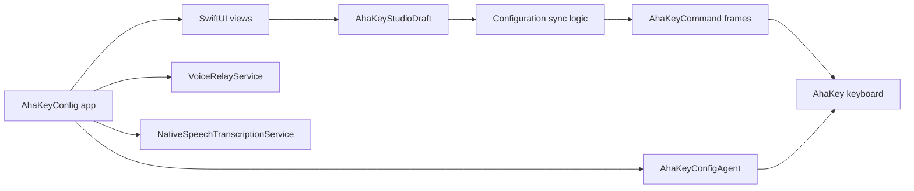

# Architecture

AhaKey Studio is a macOS SwiftUI app built with Swift Package Manager. The repository currently contains the app, a background agent, reusable VoiceAgent runtime code, BLE protocol handling, and UI prototypes.

## Targets

- `AhaKeyConfig`: main macOS app executable.
- `AhaKeyConfigUI`: reusable onboarding/design-system UI library.
- `VoiceAgent`: reusable VoiceAgent runtime library.
- `VoiceAgentLiveSession`: executable runner for VoiceAgent live sessions.
- `AhaKeyConfigAgent`: lightweight background agent.
- `AhaKeyConfigTests`: XCTest coverage for non-hardware logic.

## Runtime Flow

## Design Direction

The app target still owns several domains that can eventually become smaller library targets:

- Core models and protocol encoding
- Hardware transport
- Studio configuration planning
- macOS app shell and views

Until then, keep non-UI logic in `Sources/Utilities` and add tests for it before moving behavior between domains.
